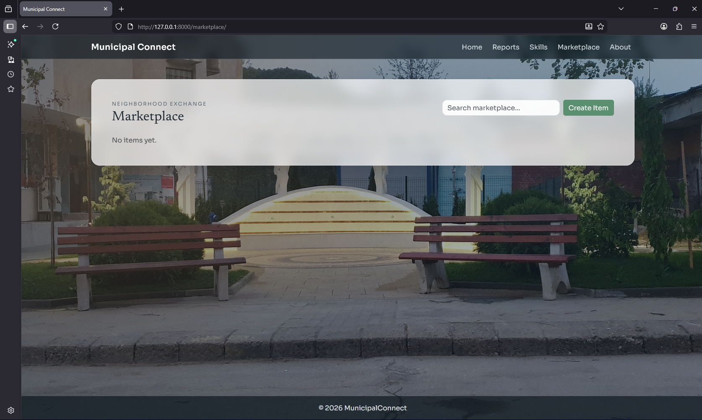
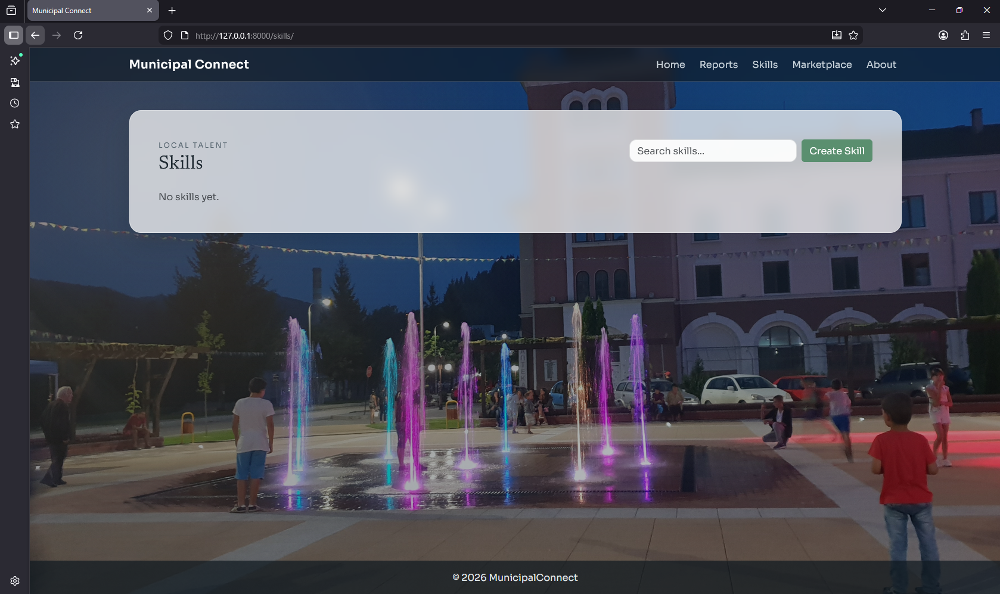
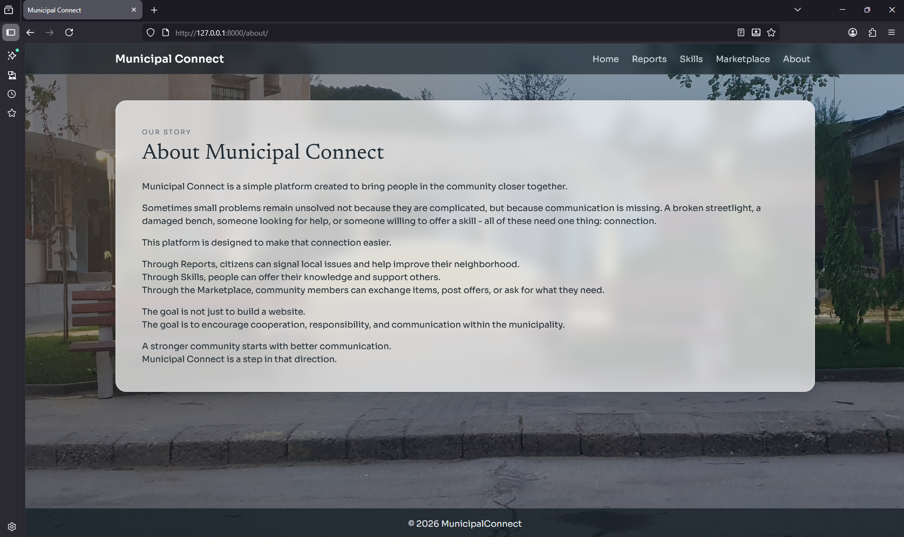

# Municipal Connect

Municipal Connect is a simple community platform built with Django.

The idea behind the project is to improve communication inside a local municipality. Sometimes small problems stay unsolved not because they are difficult, but because people don't have an easy way to report or share them.

This platform connects citizens through reports, shared skills, and a small marketplace.

---

## Features

* Create and manage **Reports** (local issues)
* Share personal **Skills**
* Post items in the **Marketplace**
* Optional condition for marketplace items
* Search functionality
* Announcement section
* Background slideshow (JavaScript)
* Django messages for user feedback
* Seed script with Faker for demo data
* Custom 404 page

---

## Apps Structure

```
common       -- home page, announcements, shared logic
reports      -- reporting local problems
skills       -- people sharing skills
marketplace  -- offer, wanted, giveaway items
```

---

## How to Run the Project

Clone the repository.

Create a virtual environment.

Install dependencies:

```
pip install -r requirements.txt
```

Apply migrations:

```
python manage.py migrate
```

(Optional) Seed the database with demo data:

```
python manage.py seed_data
```

Run the development server:

```
python manage.py runserver
```

Open in browser:

```
http://127.0.0.1:8000/
```

---

## Deployment

The project currently runs in a local development environment.

Future deployment could be done using services such as:

* Render
* Railway
* PythonAnywhere

---

## Technology Stack

* Python
* Django
* PostgreSQL
* Bootstrap 5
* JavaScript (background slideshow and UI interactions)
* Faker (for generating demo data)

---

## Design Diagram

The application follows the standard Django web architecture:

```
User
 │
 ▼
Django Templates (HTML)
 │
 ▼
Django Views
 │
 ▼
Django Models
 │
 ▼
PostgreSQL Database
```

Views process user requests, interact with models for database operations, and render templates to display the results.

---

## Screenshots

### Home Page


### Reports Page


### Marketplace



### Skills Page



### About page



---

## Purpose

This project was built as part of a Django learning journey.

The goal was to build something realistic, structured, and clean — not just a basic CRUD application.
